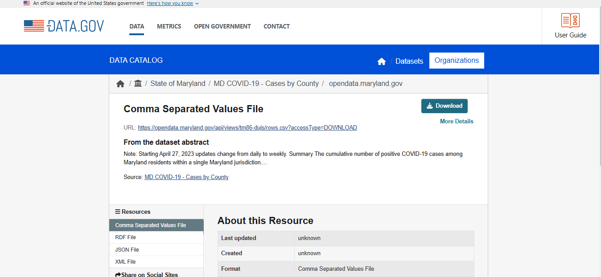
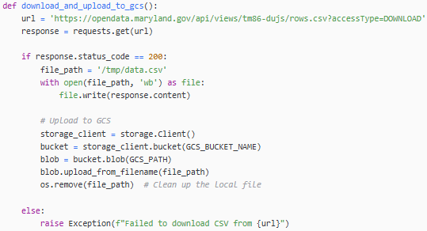
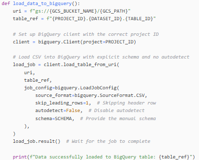
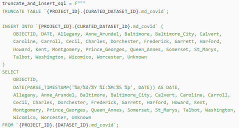
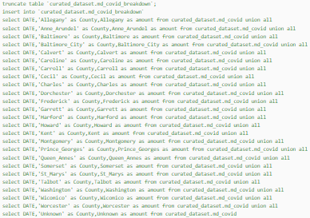
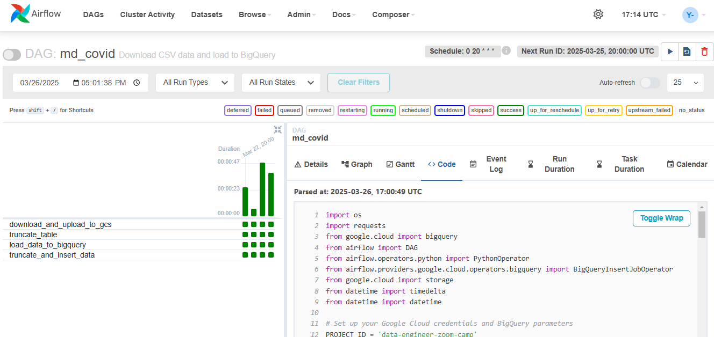
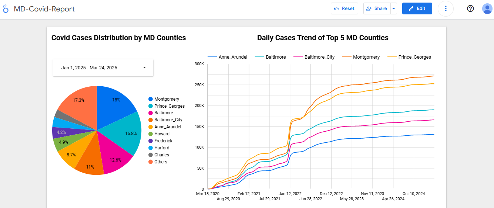

# 2025 Data Engineering Zoomcamp Final Project - Covid Data Analysis

## Overview

Coronavirus is a new word coming into everyone’s life since early 2020. Although the peak of the crisis has been over, I am curious about the impact to the state of Maryland. Therefore, for my final project for the [Data Engineering Zoomcamp](https://github.com/DataTalksClub/data-engineering-zoomcamp) by [DataTalks Club](https://datatalks.club/), I want to analyze the data to see county distribution and daily trends.

## Problem Description

- A data pipeline in Airflow needs to be built that pulls in data daily from [DATA.GOV](https://catalog.data.gov/dataset/md-covid-19-cases-by-county), ingests it by batch, and loads it into Google Cloud Storage (GCS) and then BigQuery.
- Data Transformation: The raw data needs to be transformed within BigQuery.
- Visualization: The data needs to be visualized using Google Looker Studio.
- Questions to be Answered: How are the Covid-19 cases spread across counties in Maryland? What does the daily trend look like for the top 5 counties in Maryland?

## Technology Utilized

- **Workflow Orchestration**: Airflow
- **Data Lake**: Google Cloud Storage (GCS)
- **Data Warehouse**: Google BigQuery
- **Visualization**: Google Looker Studio

## Pipeline

### Source:
Data to be loaded from the public dataset: [MD Covid-19 Cases by County - Data.gov](https://catalog.data.gov/dataset/md-covid-19-cases-by-county).

### Data Lake:
Data is stored in a data lake within a Google Cloud Storage bucket (GCS).

### Dataset:
- Staging Dataset:

- Curated Dataset:

### Data Transformation:
The raw data is transformed within BigQuery.

### Orchestration:
An orchestrated data pipeline is built in Airflow with a daily data refresh at 20:00:00 UTC.

## Visualization
The dashboard can be found here:  
[Covid-19 Data Visualization - Looker Studio](https://lookerstudio.google.com/reporting/0876bd1f-5d04-430c-9dd4-a4594d786d83/page/p_gv11gmiyqd)

*Disclaimer: The dashboard will be able to be updated until June 21, 2025 before my trial period on Google Cloud expires.*

## Future Work That Could Be Done

- **Reproducibility**: Ensure the pipeline is easily reproducible in other environments.
- **Implement CI/CD**: Set up Continuous Integration/Continuous Deployment for automated testing and deployment.
- **DBT Transformation**: Implement DBT (Data Build Tool) for better data transformations.
